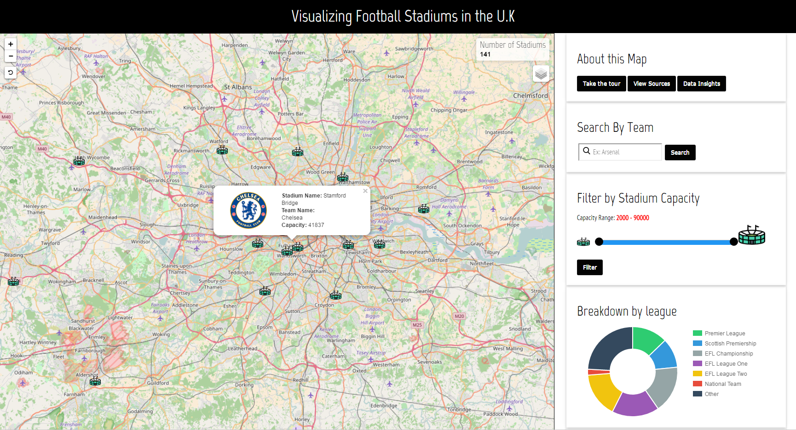

# mapping-football-stadiums
> An interactive map that displays football stadiums in the U.K and allows filtering and searching on select criteria. The map was built using Leaflet.js and stores data about the stadiums in a database. View it here: https://www.sidshekhar.com/mapping-football-stadiums/
 

<em>Map View showing stadium detail and filters on the right</em>
 

## Libraries Used
* Leaflet.js - http://leafletjs.com/
* jQuery - https://jquery.com/
* jQueryUI - https://jqueryui.com/
* Intro.js - http://introjs.com/
* Chart.js - http://www.chartjs.org/
* EasyButton.js - http://danielmontague.com/projects/easyButton.js/

## Aim
The The purpose of this map is to give the viewer a high level visualization of football stadiums across the U.K. The aim is to provide a deeper perspective into the breadth of sporting facilities available in the country - allowing the user to filter by team and capacity. 

<em>Interesting patterns can be observed in the clustering of stadiums near major metropolitan areas in England</em>

<em>The juxtaposition of <a href="https://www.nasa.gov/topics/earth/earthday/gall_earth_night.html">NASA's</a> 'Earth at Night' view below the markers shows the clustering patterns and their correlation to stadium capacity even more clearly. </em>
 

## Usage
Originally this project was put up on <a href="https://www.ucl.ac.uk/"> University College London's</a> intranet with the marker and league data hosted on a PostgreSQL database. All of the raw data can be found in [this file](dataloader2.sql) - which was sourced from Chris Bell's work found <a href="https://www.doogal.co.uk/FootballStadiums.php">here</a>. Feel free to download and host it in your own database or simply convert the data into JSON and change the mapdata.php file SQL filter functions into JavaScript functions to run the project.
